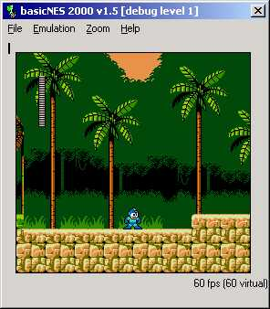



## basicNES

### Description

This code emulates the NES hardware from back in the day.
 
### More Info
 
A user capable of pressing keys on the keyboard.

You must have a .pal file in the directory you have the exe in, and you must have .NES games to play.

A NES screen.

             |
---                |---
**Submitted On**   |2003-08-03 23:01:56
**By**             |[Don Jarrett](https://github.com/Planet-Source-Code/PSCIndex/blob/master/ByAuthor/don-jarrett.md)
**Level**          |Advanced
**User Rating**    |5.0 (60 globes from 12 users)
**Compatibility**  |VB 5\.0, VB 6\.0
**Category**       |[Games](https://github.com/Planet-Source-Code/PSCIndex/blob/master/ByCategory/games__1-38.md)
**World**          |[Visual Basic](https://github.com/Planet-Source-Code/PSCIndex/blob/master/ByWorld/visual-basic.md)
**Archive File**   |[basicNES1638318312003\.zip](https://github.com/Planet-Source-Code/don-jarrett-basicnes__1-48109/archive/master.zip)

